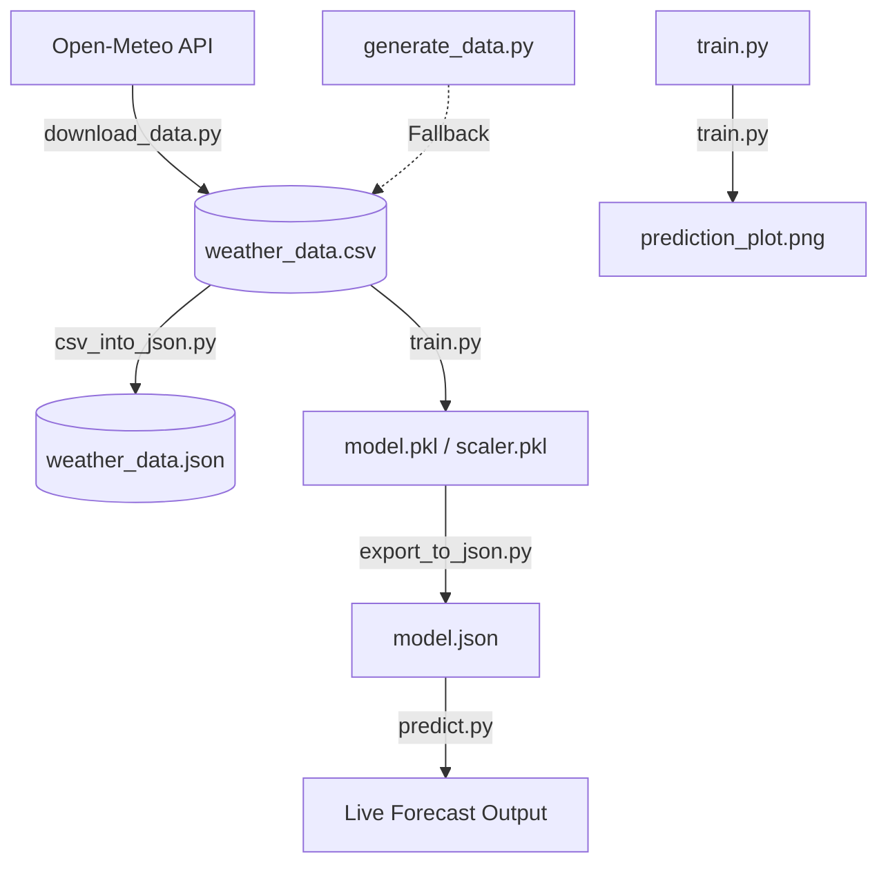

# Weather Forecast Project: Step-by-Step Guide

This beginner-friendly guide walks you through setting up your Python environment, installing dependencies, and running every script in this project.

---

## 1. Environment & Setup (From Scratch)

If you are new to Python, think of it similarly to Node.js / NPM. Python projects use **Virtual Environments** (`venv`) to keep dependencies isolated, similar to how Node.js uses `node_modules` and a `package.json`.

### Step 1: Check Python Installation
Verifies if Python is installed on your system.
* **Command**:
  ```powershell
  python --version
  ```
* **Meaning**: Shows the installed Python version.

### Step 2: Create a Virtual Environment (`venv`)
Creates an isolated sandbox environment for this project.
* **Command**:
  ```powershell
  python -m venv .venv
  ```
* **Meaning**: 
  * `-m venv` is Python's built-in module to create environments.
  * `.venv` is the name of the folder where all project-specific Python executables and downloaded packages will be stored.
  * **NPM Analogy**: Similar to initializing a clean workspace before running `npm install`.

### Step 3: Activate the Virtual Environment
Tells your PowerShell terminal to use the Python executables inside your `.venv` folder instead of the global system version.
* **Command**:
  ```powershell
  .\.venv\Scripts\Activate.ps1
  ```
  *(Note: If you receive a permission script block error, run `Set-ExecutionPolicy -ExecutionPolicy RemoteSigned -Scope Process` first).*
* **Meaning**: Activates the environment. You will see `(.venv)` appear at the beginning of your terminal line.
* **NPM Analogy**: Similar to how Node.js processes run binaries inside `./node_modules/.bin/`.

### Step 4: Install Dependencies
Downloads and installs the libraries required for data science, plotting, and machine learning.
* **Command**:
  ```powershell
  pip install numpy matplotlib pandas tzdata
  ```
* **Meaning**:
  * `pip` is the Python Package Installer.
  * `numpy` is for numerical computations and matrix math.
  * `matplotlib` is for plotting loss curves and diagrams.
  * `pandas` is for reading/manipulating data structures (specifically converting CSV to JSON).
  * **NPM Analogy**: Exactly like running `npm install numpy matplotlib pandas`.

---

## 2. Project Architecture & Flow



---

## 3. Running the Data Pipeline (Step-by-Step)

### Step 1: Ingest Data (Get your CSV)

#### Option A: Download Real Historical Data
* **Command**:
  ```powershell
  python download_data.py
  ```
* **Meaning & Use Case**: Queries the Open-Meteo API for 24 years (2000–2023) of real Bangalore weather history. If your IP address gets rate-limited (429), it automatically fetches free proxies and rotates through them over HTTP to bypass the block. Overwrites [weather_data.csv](file:///d:/Study/AI%20And%20ML/ML/04-07-2026/weather_data.csv).

#### Option B: Generate Synthetic Data (Offline Fallback)
* **Command**:
  ```powershell
  python generate_data.py
  ```
* **Meaning & Use Case**: Generates mock Bangalore-like data locally using mathematical curves. Use this if you are completely offline or if the API servers are down. Overwrites [weather_data.csv](file:///d:/Study/AI%20And%20ML/ML/04-07-2026/weather_data.csv).

---

### Step 2: Convert CSV to JSON
* **Command**:
  ```powershell
  python csv_into_json.py
  ```
* **Meaning & Use Case**: Reads the generated/downloaded [weather_data.csv](file:///d:/Study/AI%20And%20ML/ML/04-07-2026/weather_data.csv) using `pandas` and exports it into a structured list format in [weather_data.json](file:///d:/Study/AI%20And%20ML/ML/04-07-2026/weather_data.json). Useful for web-based visualizations or API interfaces.

---

### Step 3: Train the Models
* **Command**:
  ```powershell
  python train.py
  ```
* **Meaning & Use Case**: Trains three independent linear regression models (from scratch) for Max, Min, and Mean temperature. Saves the trained coefficients to `model.pkl`, the scaling factors to `scaler.pkl`, and creates the loss graphs in [prediction_plot.png](file:///d:/Study/AI%20And%20ML/ML/04-07-2026/prediction_plot.png).

---

### Step 4: Export Weights to JSON
* **Command**:
  ```powershell
  python export_to_json.py
  ```
* **Meaning & Use Case**: Reads the binary pickle files (`model.pkl` and `scaler.pkl`) and exports the raw weights and biases into a human-readable [model.json](file:///d:/Study/AI%20And%20ML/ML/04-07-2026/model.json). Run this to update your JavaScript-compatible model configurations.

---

### Step 5: Predict Tomorrow's Weather
* **Command**:
  ```powershell
  python predict.py
  ```
* **Command with arguments (CLI)**:
  ```powershell
  python predict.py --city "New Delhi" --date "tomorrow"
  ```
* **Meaning & Use Case**: Loads your trained models and queries the live forecast API for today's weather observations (Max temp, Min temp, UV index, cloud cover, pressure, wind) to forecast tomorrow's weather in the target city.

---

## 4. Git & Version Control

When pushing your project to GitHub, you should never commit your virtual environment `.venv/` (equivalent to `node_modules`) or large generated data files (like `.csv`, `.json`, and binary `.pkl` models).

We use a `.gitignore` file to tell Git to ignore these files.

### Standard Git Workflow:
1. **Initialize Git**:
   ```powershell
   git init
   ```
2. **Add Files** (respects `.gitignore` automatically):
   ```powershell
   git add .
   ```
3. **Commit Your Code**:
   ```powershell
   git commit -m "Initial commit"
   ```
4. **Push to GitHub**:
   ```powershell
   git branch -M main
   git remote add origin https://github.com/shiv2240/Weather-Forecast-Project.git
   git push -u origin main
   ```

